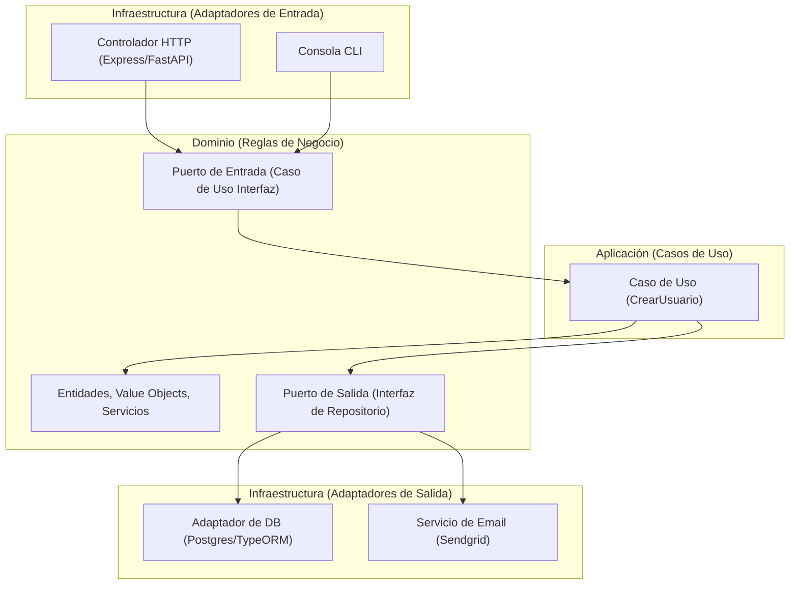

# 📐 Arquitectura Hexagonal (Puertos y Adaptadores)

[[Desarrollo Profesional/Inicio Profesional|⬅️ Volver a Desarrollo Profesional]]

> [!abstract] Arquitectura Hexagonal
> Creada por Alistair Cockburn, es un patrón de arquitectura que busca desacoplar la lógica de negocio central (el Dominio) de los agentes externos (bases de datos, frameworks web, APIs externas, interfaces de usuario).

---

## 🏗️ Capas de la Arquitectura

### 1. Dominio (Domain)
- Contiene los modelos del negocio (Entidades, Objetos de Valor) y reglas de negocio puras.
- No tiene dependencias de ningún framework o biblioteca externa.
- Define los **Puertos** (interfaces) para interactuar con el exterior.

### 2. Aplicación (Application)
- Orquesta los **Casos de Uso** del sistema (acciones del usuario como "Registrar un usuario").
- Implementa los puertos de entrada y llama a los puertos de salida.

### 3. Infraestructura (Infrastructure)
- Contiene la implementación técnica concreta de las interfaces (los **Adaptadores**).
- *Adaptadores de Entrada (Primary):* Controladores REST, comandos CLI, listeners de eventos.
- *Adaptadores de Salida (Secondary):* Acceso a base de datos (Postgres, Mongo), clientes de correo, APIs externas.

---

## 🔌 Puertos vs Adaptadores

- **Puerto (Port):** Es la definición de la interfaz o contrato (ej. `UserRepository`). Pertenece al Dominio/Aplicación.
- **Adaptador (Adapter):** Es la implementación de dicho puerto para una tecnología específica (ej. `PostgresUserRepository`). Pertenece a la Infraestructura.

---
`#arquitectura` `#hexagonal` `#patrones` `#apuntes`
