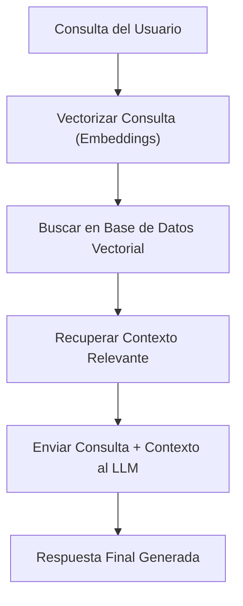

# 🤖 Inteligencia Artificial (IA)

[[Desarrollo Profesional/Inicio Profesional|⬅️ Volver a Desarrollo Profesional]]

> [!abstract] Inteligencia Artificial
> Rama de la informática dedicada al desarrollo de sistemas capaces de realizar tareas que simulan procesos de inteligencia humana, como el aprendizaje, el razonamiento y la resolución de problemas.

---

## 🔑 Ramas Principales

### 1. Machine Learning (Aprendizaje Automático)
Sistemas que aprenden de los datos para realizar tareas sin ser programados explícitamente.
- **Supervisado:** Clasificación y Regresión (ej. predecir precios).
- **No Supervisado:** Clustering y Agrupamiento (ej. segmentar clientes).
- **Por Refuerzo:** Aprendizaje basado en prueba y error mediante recompensas.

### 2. Deep Learning (Aprendizaje Profundo)
Subconjunto de Machine Learning basado en Redes Neuronales Artificiales con múltiples capas (profundas), clave para visión por computadora y procesamiento de lenguaje natural (PLN).

---

## 💬 Modelos de Lenguaje (LLMs) y Generación

- **LLM (Large Language Model):** Modelos de lenguaje masivos entrenados con cantidades masivas de texto (ej. GPT, Gemini, Claude, Llama).
- **Prompt Engineering (Ingeniería de Prompts):** Técnicas para estructurar entradas de texto con el fin de obtener las mejores respuestas de un LLM.
  - *Zero-shot:* Pedir algo sin dar ejemplos.
  - *Few-shot:* Proporcionar algunos ejemplos de entrada y salida deseada en el prompt.
  - *Chain of Thought:* Pedir al modelo que "piense paso a paso".

---

## ⚡ Patrón RAG (Retrieval-Augmented Generation)
Combina las capacidades de generación de los LLMs con la búsqueda de información externa en tiempo real, evitando "alucinaciones" y permitiendo consultar datos privados actualizados.

---
`#ia` `#ai` `#machinelearning` `#llm` `#apuntes`
